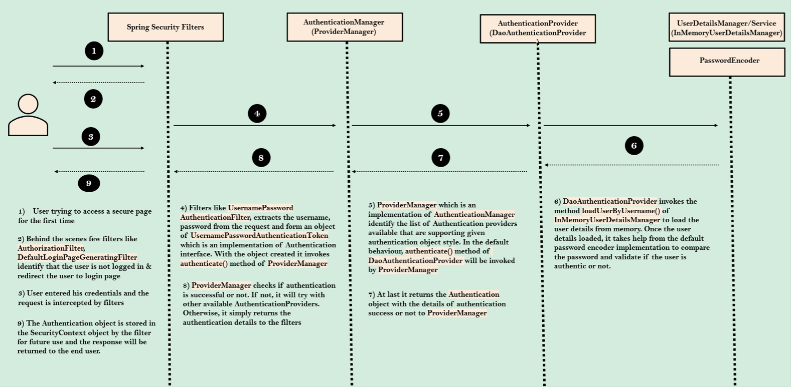
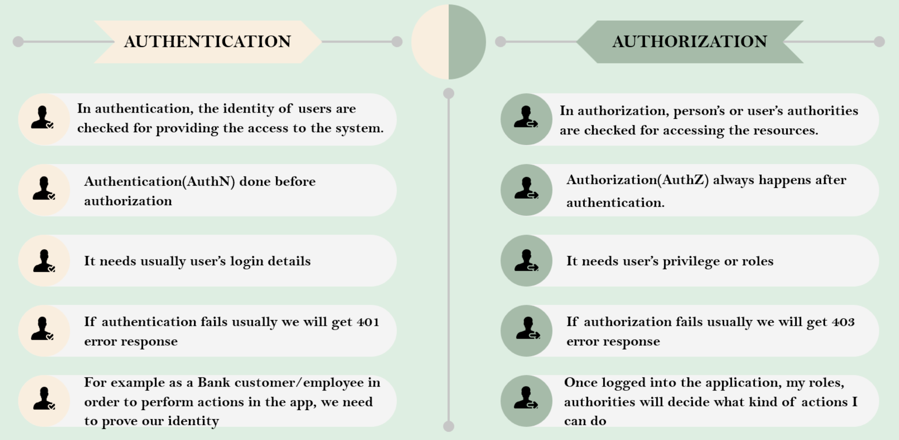

# Spring Security

- [Understanding Spring Security Internal Flow](https://www.youtube.com/watch?v=caCJAJC41Rk&ab_channel=JavaBrains)

## Spring Security Internal Flow (Filters, Authentication Manager, Authentication Providers)

- Checks the path the user is trying to access on whether the user needs to be authenticated to access the resource.
  - Upon successful authentication, the next time spring security filter will know the user has been authenticated before based on the sessionID or token.
  - Stores the **authentication details** in the Security Context so Spring will not authenticate the user again after he has been authenticated.
- Extracts username and password and convert into an **authentication object** to store credentials of the user.
- Hands over the authentication request to the authentication manager.
- Authentication manager checks for the available authentication providers in the web application.
  - Write business logic in the authentication providers.
  - Can have multiple authentication provider and write authentication logic.

## Overview of how `AuthenticationProvider` is used in Spring Security



1. **Authentication Request**: When a user tries to authenticate, typically by submitting a login form with a username and password, an authentication request is triggered.
2. **Authentication Token**: The provided credentials (username and password) are encapsulated in an `Authentication` object. The `UsernamePasswordAuthenticationToken` is an implementation of the `Authentication` interface to carry the user's credentials (username and password) during the authentication process in Spring Security.
3. **Authentication Manager**: The `AuthenticationManager` is responsible for processing the authentication request. It receives the `Authentication` object and delegates the authentication process to one or more `AuthenticationProvider` instances.
4. **AuthenticationProvider**: The `AuthenticationProvider` is responsible for validating the credentials and returning an authenticated `Authentication` object. It performs the necessary authentication logic, such as verifying the username/password combination, checking account status, and retrieving user roles or authorities.
5. **UserDetailsService**: In the authentication process, the `AuthenticationProvider` typically relies on a `UserDetailsService` to retrieve user details, such as username, password and authorities. The `UserDetailsService` interface provides a method called `loadUserByUsername`, which is used to load user details based on the provided username.
6. **Authentication Flow**: The `AuthenticationProvider` uses the `UserDetailsService` to load the user details for the provided username. It then compares the provided password with the store password (after applying any necessary password encoding). If the credentials are valid, the `AuthenticationProvider` constructs and returns a fully authenticated `Authentication` object.
7. **Authentication Result**: The `AuthenticationManager` receives the authentication `Authentication` object from the `AuthenticationProvider` and returns it to the caller (usually the Spring Security framework or the application code). If the authentication is successful, the user is considered authenticated and can proceed to access protected resources.

-----

- Notes:
        - Spring Security supports multiple `AuthenticationProvider` implementations, allowing for various authentication mechanisms such as database-backed authentication (`DaoAuthenticationProvider`), LDAP authentication (`LdapAuthenticationProvider`), and more.
        - The more appropriate `AuthenticationProvider` is selected based on the type of `Authentication` object being processed.

-----

## Spring Security Internal Flow (ChatGPT)

1. User enters credentials into the login form.
2. The request passes through the Spring Security filters for the first pass, including the `UsernamePasswordAuthenticationFilter`, which extracts the credentials and creates an `Authentication` object.
3. The `AuthenticationManager` receives the 

## New Annotations

|   Annotations    |                                                     Description                                                      |
| :--------------: | :------------------------------------------------------------------------------------------------------------------: |
| `@ComponentScan` |                                            Controllers in other packages.                                            |
| `@Configuration` | Define all the configurations in the class. When Spring Boot starts up, all the beans will be scanned in that class. |

## Authentication certain endpoints

```java
/**
 * Custom Security Configurations
 */
@Bean
SecurityFilterChain defauSecurityFilterChain(HttpSecurity http) throws Exception {
    http.authorizeHttpRequests((requests) -> requests
            .requestMatchers("/myAccount", "/myBalance", "/myLoans", "/myCards").authenticated()
            .requestMatchers("/notices", "/contact").permitAll())
            .formLogin(Customizer.withDefaults()).httpBasic(Customizer.withDefaults());
    return http.build();
}

/**
 *  Configuration to deny all the requests
 */
http.authorizeHttpRequests(requests -> requests.anyRequest().denyAll())
        .formLogin(Customizer.withDefaults())
        .httpBasic(Customizer.withDefaults());
return http.build();

/**
 *  Configuration to permit all the requests (Good for development)
 */
http.authorizeHttpRequests(requests -> requests.anyRequest().permitAll())
        .formLogin(Customizer.withDefaults())
        .httpBasic(Customizer.withDefaults());
return http.build();
```

## Storing `UserDetails`

- Only define 1 in the `ProjectSecurityConfig.java` which is the config file with annotation `@Configuration`.
        - Spring will read and select the defined method of storing `UserDetails`.

|Methods to Store|Description|
|:-:|:-:|
|`InMemoryUserDetailsManager`|Storing UserDetails such as username and password in memory. Typically used for demo application or testing scenarios where user information is static and not needed to be persisted in database.|
|`JdbcUserDetailsManager`|Storing UserDetails in database with predefined SQL statements. Used for smaller application, not for production. The SQL scripts are predefined. If we want a different table name or different column name (e.g., email), then we need a new UserDetailsService and UserDetailsManager.|
|`LdapUserDetailsManager`|*Uncommon* unless you have Ldap server with UserDetails.|

## SQL Tables for `JdbcUserDetailsManager` for MySQL

- Can go with our own table name and column name (RECOMMENDED APPROACH).
        - Cannot use `JdbcUserDetailsManager` for this case.
        - Have to write own logic.
 
## `UserDetailsService`

- `UserDetailsService` interface is responsible for loading user-specific data during the authentication process.
- It provides a single method `loadUserByUsername()` that takes a username as input and returns a `UserDetails` object containing the user's information.
- Can create custom implementations of `UserDetailsService` to load user details from various sources such as database, an LDAP server, or an external API.
- Spring Security provides some built-in implementations such as `JdbcUserDetailsManager` for database-backed user details, `LdapUserDetailsService` for LDAP authentication, etc.
- Can have multiple implementation of `UserDetailsService` if needed, but only one can be used by an `AuthenticationProvider` at a time.

## `UserDetailsManager`

- From Spring Security `UserDetailsManager`, used in an application to allow create, delete, update, select, change password, etc.
- However, we typically create our own implementations of the CRUD for users in our own controllers.

## Encoding vs Encryption vs Hashing


## Different Implementations of `PasswordEncoder` (interface to support password encoding)

- `NoOpPasswordEncorder`: password in plain text (not recommended for production, for testing purposes only).
- `StandardPasswordEncoder`: for legacy purposes and not secure (not recommended for production).
- `Pbkdf2PasswordEncoder`: not secure, can apply brute-force attack to derive the correct plain-text password with strong GPU (not recommended for production).
- ✅ `BCryptPasswordEncorder`: Used extensively, can set salt rounds, need higher CPU to hash the password. ✅✅✅
        - `BCryptPasswordEncoder()`: default salt rounds of 10.
        - `BCryptPasswordEncoder(20)`: salt rounds of 20. must be 4 - 31.
- ✅ `SCryptPasswordEncorder`: Advanced version of BCryptPasswordEncoder. Takes into account CPU and memory. Performance issue because it takes a long time to process whenever we hash password.
- ✅ `Argon2PasswordEncorder`: Takes into account CPU, memory and multiple threads. Performance issue because it takes a long time to process whenever we hash password.

## Custom Authentication Provider

- Instead of using the default `DaoAuthenticationProvider`, we should use a custom authentication provider.
- Can have multiple authentication providers
        - Requirement 1: accept username and password
        - Requirement 2: accept OAUTH2 authentication
        - Requirement 3: accept OTP authentication
- `authenticate()` method receives and returns Authentication object. Implement all the custom authentication logic inside `authenticate` method.
- Deleted custom `UserDetailsService` because we no longer want to use `DaoAuthenticationProvider`

## Pre-Flight request by browser

- When a browser makes a cross-origin request to a backend server, it first performs a pre-flight request to determine if the backend server allows the actual API request.
- The pre-flight request is an HTTP OPTIONS request that the browser sends to the server with the intention of checking the server's CORS (Cross-Origin Resource Sharing) policy.
- The browser includes certain *headers* in the pre-flight request, such as Origin and Access-Control-Request-Method, to provide information about the intended cross-origin request.
- If the server allows the specific cross-origin request from the browser, it responds with appropriate headers, including Access-Control-Allow-Origin, Access-Control-Allow-Methods, and others, indicating that the actual API request can proceed.


- In the picture above, it shows that the preflight request was made before the actual API request.

## CORS Configuration

- As part of the CORS policy, Domain, Port & Scheme (HTTP/HTTPS) are considered to identify "other origins".
- `AllowedMethods`: Specifies which HTTP methods are allowed for cross-origin requests, typically including GET and POST.
- `AllowedCredentials`: Indicates whether the server can accept credentials (e.g., cookies, HTTP authentication) from the client in cross-origin requests.
- `AllowedHeaders`: Defines the HTTP headers that are allowed to be included in cross-origin requests.
- `MaxAge`: Specifies the maximum time (in seconds) that the browser can cache the CORS configuration, reducing the number of preflight requests made within that time frame.

## CSRF Security Attack

- CSRF (Cross-Site Request Forgery) exploits the trust of a user's authenticated session to perform unwanted actions.
- Does not directly steal the user's identity.
- Spring Security provides protection against CSRF **by default**.
- Spring Security applies CSRF protection to all HTTP methods, excluding GET, to prevent unauthorized actions.
- To handle CSRF attack, application needs to determine if HTTP request is generated via the application's user interface.
    - Use a CSRF token which is a secure random token that is used to prevent CSRF attacks.
    - CSRF related cookie in browser.
- `CsrfTokenRequestAttributeHandler`: Implementation of `CsrfTokenRequestHandler` interface that is capable of making the `CsrfToken` available as a request attribute and resolving the token value as either a header or parameter value of the request.
- Sent to UI Applicatoin
    - `DEFAULT_CSRF_COOKIE_NAME`: "XSRF-TOKEN"
    - `DEFAULT_CSRF_HEADER_NAME`: "X-XSRF-TOKEN"
    - `withHttpOnlyFalse`: to allows javascript application in Angular to read cookie value.

## CSRF Procedure

```js
// Getting cookie from browser during user login
let xsrf = getCookie('XSRF-TOKEN')!;
window.sessionStorage.setItem("XSRF-TOKEN", xsrf);
```

```js
// Before sending any request to Backend Server
let xsrf = sessionStorage.getItem("XSRF-TOKEN");
if (xsrf) {
    httpHeaders = httpHeaders.append("X-XSRF-TOKEN", xsrf);
}
```

```java
@Override
protected void doFilterInternal(HttpServletRequest request, HttpServletResponse response,
        FilterChain filterChain) throws ServletException, IOException {
    CsrfToken csrfToken = (CsrfToken) request.getAttribute(CsrfToken.class.getName());
    if (null != csrfToken.getHeaderName()) {
        response.setHeader(csrfToken.getHeaderName(), csrfToken.getToken());
    }
    filterChain.doFilter(request, response);
}
```

## `JSESSIONID`

- `.sessionManagement(session -> session.sessionCreationPolicy(SessionCreationPolicy.ALWAYS))`: creating `JSESSIONID` after login operation. Included this because we are using our own UI for authentication instead of the default Spring Security UI for authentication.

```java
http.securityContext((context) -> context
                .requireExplicitSave(false))
        .sessionManagement(session -> session.sessionCreationPolicy(SessionCreationPolicy.ALWAYS))
```

## Filters in Java Spring Security

- Filters are similar to middleware.

## Authentication vs Authorization



- Authorities/Roles information in Spring Security is stored inside `GrantedAuthority`.
    - Inside `UserDetails` interface which is a contract of the user inside the Spring Security, the authorities of a user stored in the form of collection in `GrantedAuthority`.
- `SimpleGrantedAuthority` is the default implementation class of GrantedAuthority interface inside Spring Security framework.

```java
// Entity class
@JsonIgnore
@OneToMany(mappedBy="customer",fetch=FetchType.EAGER)
private Set<Authority> authorities
```

- Using `@OneToMany` to tell Spring Data JPA that a single customer can have many authorities/roles.

## Configuring Authorities

- `hasAuthority()`: checks if a user has a specific authority.
- `hasAnyAuthority()`: checks if a user has any of the specified authorities.
- `access()`: used to apply custom access control rules based on SpEL expressions.

## Configuring Roles

- `hasRole()`: checks if the authenticated user has a specific role.
- `hasAnyRole()`: checks if the authenticated user has any of the specified roles.
- `access()`: defines access rules based on SpEL (Spring Expression Language) expressions.

## Internal Filters of Spring Security

- For DEVELOPMENT only
    - `@EnableWebSecurity(debug = true)` to see the debugging of the security details.
    - `logging.level.org.springframework.security.web.FilterChainProxy=DEBUG`: enable logging details by adding this line into `application.properties`.

## Custom Filters in Spring Security

- Create own filters by implementing the **Filter** interface from the `jakarta.servlet` package.
- Override the `doFilter()` method to have own custom logic.
- `doFilter()` accepts 3 parameters: `ServletRequest`, `ServletResponse` and `FilterChain`.
- `chain.doFilter(request, response);`: invoking the next filter in the filter chain.

```java
// SecurityFilterChain
.addFilterAfter(new CsrfCookieFilter(), BasicAuthenticationFilter.class)
.addFilterBefore(new RequestValidationBeforeFilter(), BasicAuthenticationFilter.class)
.addFilterAt(new AuthoritiesLoggingAtFilter(), BasicAuthenticationFilter.class)
.addFilterAfter(new AuthoritiesLoggingAfterFilter(), BasicAuthenticationFilter.class)

// Debugger
AuthoritiesLoggingAtFilter
BasicAuthenticationFilter
CsrfCookieFilter
AuthoritiesLoggingAfterFilter
```

## `GenericFilterBean` and `OncePerRequestFilter`

- Can include the following filters into our own custom filters.
- `GenericFilterBean`: abstract class. Implementation of `Filter` interface. Provides details of config parameters, init parameters, and servlet context parameters configured in web.xml.
- `OncePerRequestFilter`: filter is executed only once per request.
    - Previously, in our custom filters, we write our business logic in the method `doFilter()` but now this method is being used to check whether the filter has been invoked.
    - So, we cannot override the `doFilter()` method in the `OncePerRequestFilter`.
    - To override the business logic, we will write it inside the `doFilterInternal()` method.
    - Can use `shouldNotFilter()` method to have exceptional filtering scenarios. E.g., maybe you want this filter to be applied to certain requests.

## JWT Token Configuration

```java
// Inside Config class
http.sessionManagement().sessionCreationPolicy(SessionCreationPolicy.STATELESS) // tells Spring not to generate any session by itself, e.g., JSESSIONID
```

- `Issuer`: Person or organization issuing the token.
- `Subject`: JWT Token
- In Angular, saving the JWT Token in the browser session storage after receiving it from the response header in Spring Security.
        - `window.sessionStorage.setItem("Authorization", responseData.headers.get('Authorization')!);`
- In Angular, for every request, send back the JWT Token to Spring Security to validate the token.
    ```js
    let authorization = sessionStorage.getItem('Authorization')
    if (authorization) {
            httpHeaders = httpHeaders.append('Authorization', authorization);
    }
    ```

# Method Level Security

- `@EnableMethodSecurity`
        - properties: `prePostEnabled`, `securedEnabled`, `jsr250Enabled`
- Invocation authorization
- Filtering authorization
- `@PostAuthorize`: used when you want to evaluate the object that is sent back to the user.
- `@PreAuthorize`: used to check whether the user can access the method.
- `@PreFilter`: applied to type Collection interface like List, Set, Map, etc.
- `@PostFilter`: return type must be of type Collection interface.

# OAUTH2

- **Separate Auth server** for Authentication & Authorization.
- Free and Open Source Protocol.
- Uses an access token which provides limited access to someone, without handing over full control in the form of the master key.
- OAuth framework creates new grant types:
    - Authorization Code
    - PKCE
    - Client Credentials
    - Device Code (E.g., Apple TV, Android TV): No keyboard to enter credentials
    - Refresh Token
    - Implicit Flow (Legacy)
    - Password Grant (Legacy)
- [Using OAuth 2.0 to Access Google APIs](https://developers.google.com/identity/protocols/oauth2)
- [OAuth 2.0 Playground](https://oauth.com/playground)

## OAUTH2 Terminology

- Resource owner: It is the end user.
- Client: Third party application trying to interact with our application.
- Authorization Server: The server which knows about resource owner. Resource owner should have an account in this server. Issues the Access Token.
- Resource Server: This is the server where the APIs, services that client want to consume are hosted. Validates Access Token with the Auth Server.
- Scopes: These are the granular permissions the Client wants, such as access to data or to perform certain actions.

## Why is Implicit Flow less secure than OAuth 2.0?

|Security Concerns|Implicit Flow|OAuth 2.0 Flow|
|---|---|---|
|Access Token Exposure|Access token is exposed in the browser's URL fragment, increasing the risk of leakage and potential unauthorized access.|Access token is transmitted securely to the client's backend server and not exposed to the client-side application.|
|Token Validation|Lack of token validation on the client side.|Tokens are validated by the authorization server, ensuring authenticity and integrity.|
|Token Revocation|Lack of a straightforward mechanism for token revocation, reducing control over token lifetimes.|Token revocation is supported, allowing better control over access and addressing scenarios like device compromise or user revocation.|
|Centralized Management|Decentralized token management, relying on client-side implementations.|Token management occurs centrally within the authorization server, minimizing inconsistencies and vulnerabilities.|

- *Token Revocation*: process of invalidating or terminating an access token before its expiration time. Ensures the secure management of access tokens, maintaining control over resource access, and mitigating potential risks and unauthorized access.