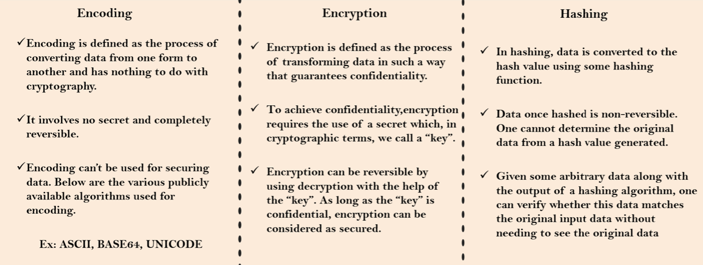

# Spring Security with Basic Authentication

## Spring Security Internal Flow (Filters, Authentication Manager, Authentication Providers)

- Checks the path the user is trying to access on whether the user needs to be authenticated to access the resource.
  - Upon successful authentication, the next time spring security filter will know the user has been authenticated before based on the sessionID or token.
  - Stores the **authentication details** in the Security Context so Spring will not authenticate the user again after he has been authenticated.
- Extracts username and password and convert into an **authentication object** to store credentials of the user.
- Hands over the authentication request to the authentication manager.
- Authentication manager checks for the available authentication providers in the web application.
  - Write business logic in the authentication providers.
  - Can have multiple authentication provider and write authentication logic.

## Overview of how `AuthenticationProvider` is used in Spring Security

1. **Authentication Request**: When a user tries to authenticate, typically by submitting a login form with a username and password, an authentication request is triggered.
2. **Authentication Token**: The provided credentials (username and password) are encapsulated in an `Authentication` object. The `UsernamePasswordAuthenticationToken` is an implementation of the `Authentication` interface to carry the user's credentials (username and password) during the authentication process in Spring Security.
3. **Authentication Manager**: The `AuthenticationManager` is responsible for processing the authentication request. It receives the `Authentication` object and delegates the authentication process to one or more `AuthenticationProvider` instances.
4. **AuthenticationProvider**: The `AuthenticationProvider` is responsible for validating the credentials and returning an authenticated `Authentication` object. It performs the necessary authentication logic, such as verifying the username/password combination, checking account status, and retrieving user roles or authorities.
5. **UserDetailsService**: In the authentication process, the `AuthenticationProvider` typically relies on a `UserDetailsService` to retrieve user details, such as username, password and authorities. The `UserDetailsService` interface provides a method called `loadUserByUsername`, which is used to load user details based on the provided username.
6. **Authentication Flow**: The `AuthenticationProvider` uses the `UserDetailsService` to load the user details for the provided username. It then compares the provided password with the store password (after applying any necessary password encoding). If the credentials are valid, the `AuthenticationProvider` constructs and returns a fully authenticated `Authentication` object.
7. **Authentication Result**: The `AuthenticationManager` receives the authentication `Authentication` object from the `AuthenticationProvider` and returns it to the caller (usually the Spring Security framework or the application code). If the authentication is successful, the user is considered authenticated and can proceed to access protected resources.

-----

- Notes:
        - Spring Security supports multiple `AuthenticationProvider` implementations, allowing for various authentication mechanisms such as database-backed authentication (`DaoAuthenticationProvider`), LDAP authentication (`LdapAuthenticationProvider`), and more.
        - The more appropriate `AuthenticationProvider` is selected based on the type of `Authentication` object being processed.

-----

## New Annotations

|   Annotations    |                                                     Description                                                      |
| :--------------: | :------------------------------------------------------------------------------------------------------------------: |
| `@ComponentScan` |                                            Controllers in other packages.                                            |
| `@Configuration` | Define all the configurations in the class. When Spring Boot starts up, all the beans will be scanned in that class. |

## Authentication certain endpoints

```java
/**
 * Custom Security Configurations
 */
@Bean
SecurityFilterChain defauSecurityFilterChain(HttpSecurity http) throws Exception {
    http.authorizeHttpRequests((requests) -> requests
            .requestMatchers("/myAccount", "/myBalance", "/myLoans", "/myCards").authenticated()
            .requestMatchers("/notices", "/contact").permitAll())
            .formLogin(Customizer.withDefaults()).httpBasic(Customizer.withDefaults());
    return http.build();
}

/**
 *  Configuration to deny all the requests
 */
http.authorizeHttpRequests(requests -> requests.anyRequest().denyAll())
        .formLogin(Customizer.withDefaults())
        .httpBasic(Customizer.withDefaults());
return http.build();

/**
 *  Configuration to permit all the requests (Good for development)
 */
http.authorizeHttpRequests(requests -> requests.anyRequest().permitAll())
        .formLogin(Customizer.withDefaults())
        .httpBasic(Customizer.withDefaults());
return http.build();
```

## Storing `UserDetails`

- Only define 1 in the `ProjectSecurityConfig.java` which is the config file with annotation `@Configuration`.
        - Spring will read and select the defined method of storing `UserDetails`.

|Methods to Store|Description|
|:-:|:-:|
|`InMemoryUserDetailsManager`|Storing UserDetails such as username and password in memory. Typically used for demo application or testing scenarios where user information is static and not needed to be persisted in database.|
|`JdbcUserDetailsManager`|Storing UserDetails in database with predefined SQL statements. Used for smaller application, not for production. The SQL scripts are predefined. If we want a different table name or different column name (e.g., email), then we need a new UserDetailsService and UserDetailsManager.|
|`LdapUserDetailsManager`|*Uncommon* unless you have Ldap server with UserDetails.|

## SQL Tables for `JdbcUserDetailsManager` for MySQL

- Can go with our own table name and column name (RECOMMENDED APPROACH).
        - Cannot use `JdbcUserDetailsManager` for this case.
        - Have to write own logic.
 
## `UserDetailsService`

- `UserDetailsService` interface is responsible for loading user-specific data during the authentication process.
- It provides a single method `loadUserByUsername()` that takes a username as input and returns a `UserDetails` object containing the user's information.
- Can create custom implementations of `UserDetailsService` to load user details from various sources such as database, an LDAP server, or an external API.
- Spring Security provides some built-in implementations such as `JdbcUserDetailsManager` for database-backed user details, `LdapUserDetailsService` for LDAP authentication, etc.
- Can have multiple implementation of `UserDetailsService` if needed, but only one can be used by an `AuthenticationProvider` at a time.

## `UserDetailsManager`

- From Spring Security `UserDetailsManager`, used in an application to allow create, delete, update, select, change password, etc.
- However, we typically create our own implementations of the CRUD for users in our own controllers.

## Encoding vs Encryption vs Hashing



## Different Implementations of `PasswordEncoder`

- `NoOpPasswordEncorder`: password in plain text (not recommended for production, for testing purposes only).
- `StandardPasswordEncoder`: for legacy purposes and not secure (not recommended for production).
- `Pbkdf2PasswordEncoder`: not secure, can apply brute-force attack to derive the correct plain-text password with strong GPU (not recommended for production).
- ✅ `BCryptPasswordEncorder`: Used extensively, can set salt rounds, need higher CPU to hash the password. ✅✅✅
- ✅ `SCryptPasswordEncorder`: Advanced version of BCryptPasswordEncoder. Takes into account CPU and memory. Performance issue because it takes a long time to process whenever we hash password.
- ✅ `Argon2PasswordEncorder`: Takes into account CPU, memory and multiple threads. Performance issue because it takes a long time to process whenever we hash password.

